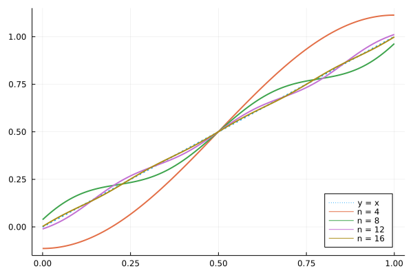
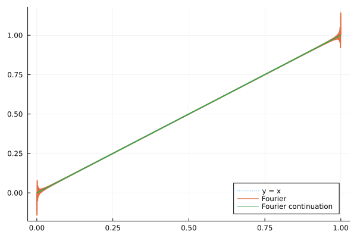

# Fourier-continuation

Implementation of the fourier continuation framework of [Anand 2018](https://arxiv.org/abs/1807.05552) to interpolate non-periodic function.

```
# exemple with identity line
using Plots
x = range(0.0, 1.0; length = 1024)
y = identity.(x)
Intp = TrigoPolyFC(y, 15, 1);
p = plot(x, y; legend = :bottomright, label = "y = x", linewidth = 2, linestyle = :dot)
for k in 2:2:8
    # truncated fourier serie interpolation
    plot!(p, range(0.0, 1.0; length = 16 * 1024), x -> Intp(x, k); label = "n = " * string(2 * k), linewidth = 2)
end
p
```

```
g = Gibbs_FC(y) # Fourier serie interpolation will suffer from gibbs ringing
p = plot(x, y; legend = :bottomright, label = "y = x", linewidth = 2, linestyle = :dot)
plot!(p, range(0.0, 1.0; length = 16 * 1024), g; label = "Fourier", linewidth = 2)
plot!(p, range(0.0, 1.0; length = 16 * 1024), x -> Intp(x); label = "Fourier continuation", linewidth = 2)
p
```

